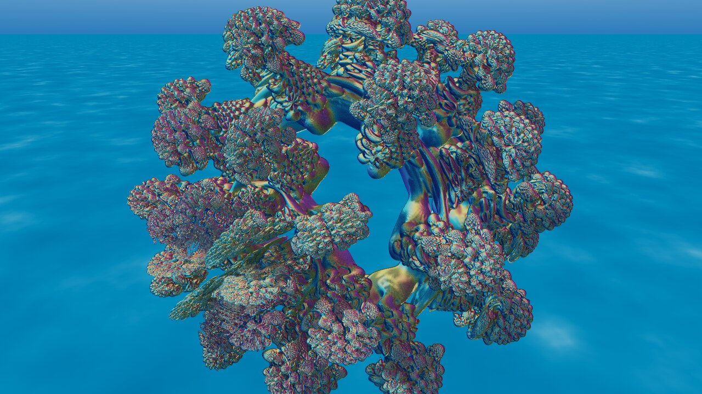
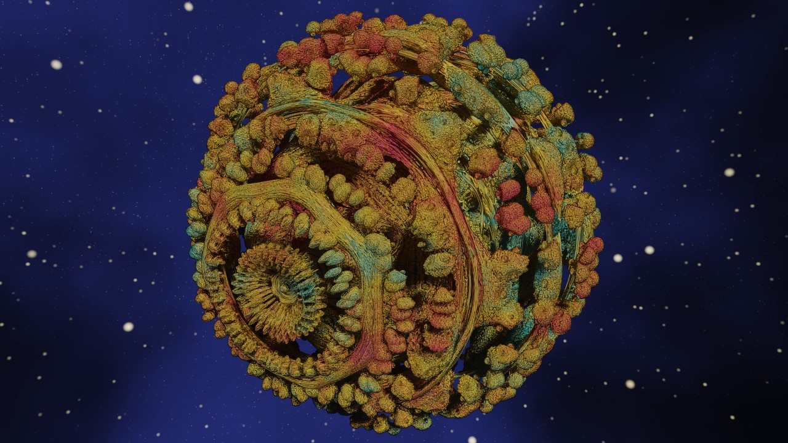
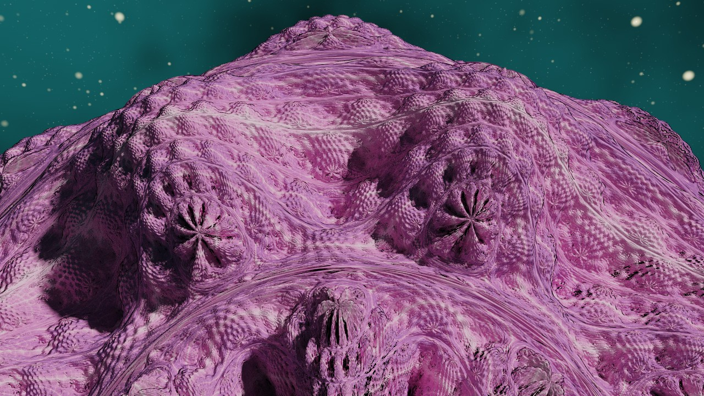
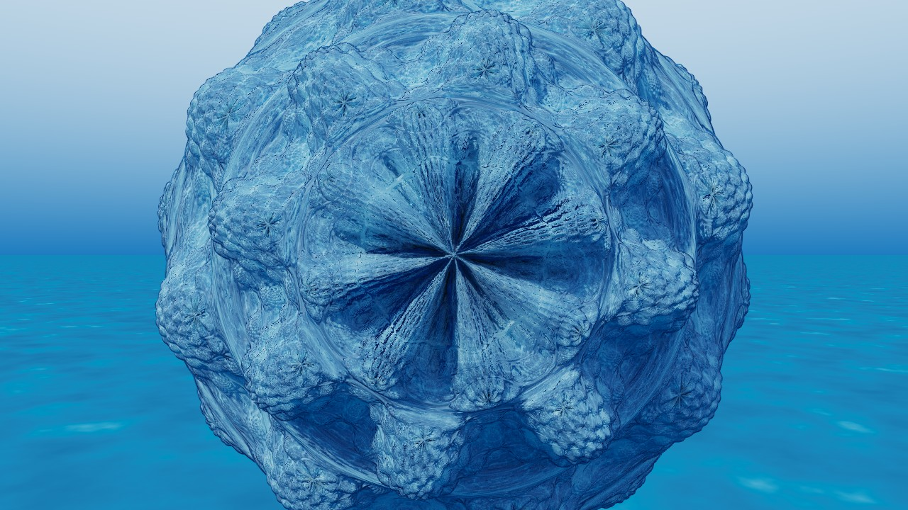
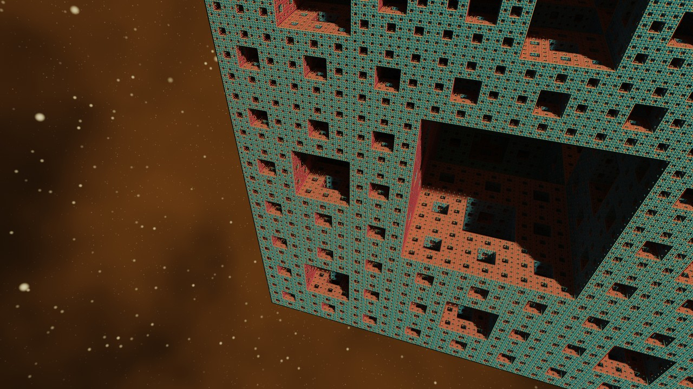
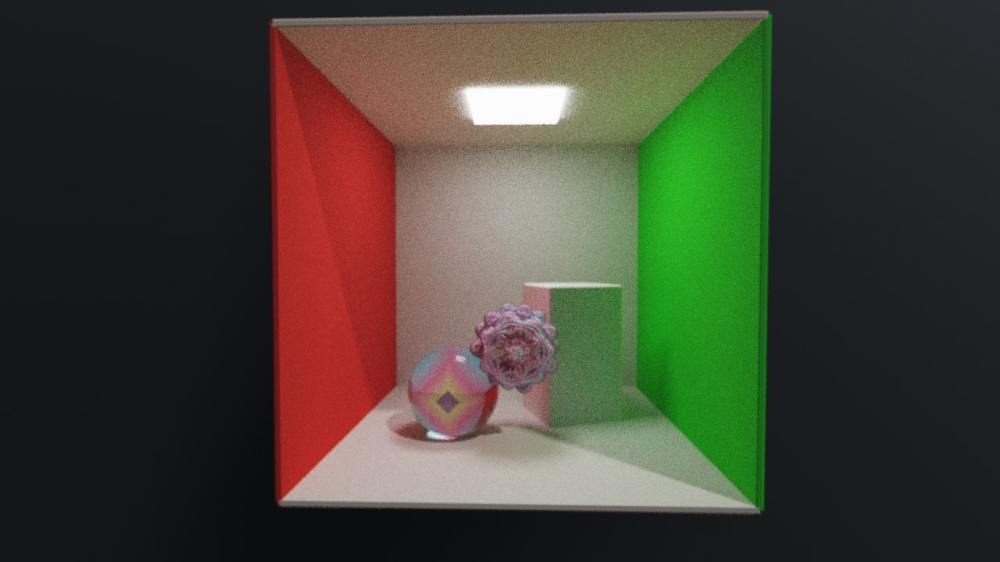
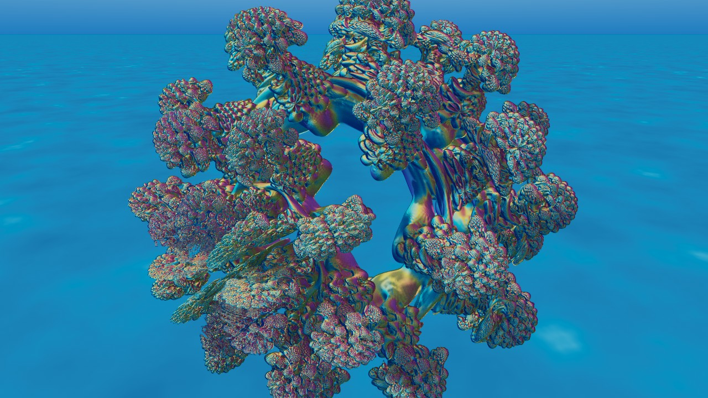
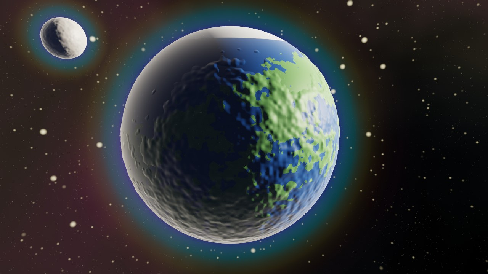
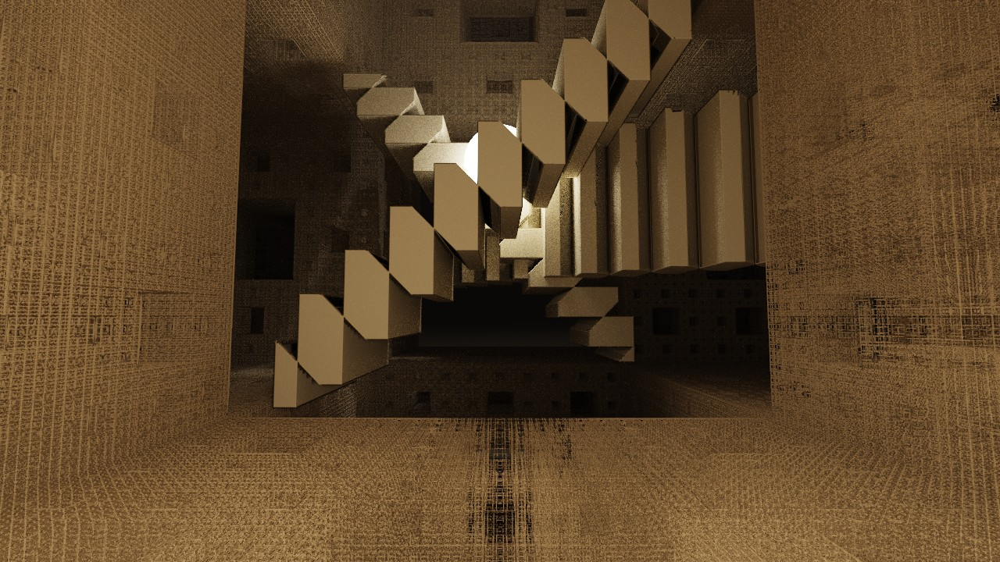

# Fractaliz3r

**Fractaliz3r** is a real-time, cinematic 3D fractal explorer and renderer. Scenes are built in a
node graph, compiled into a single GLSL shader and rendered on the GPU with progressive
raymarching, path tracing and a full post-processing chain.

[](https://github.com/warnotte/Fractaliz3r/actions/workflows/ci.yml)


[](LICENSE)



---

## Gallery

Every image below is a shipped preset: open it from `presets/` and you are looking at the same
scene, live. All were rendered by the app at 1280×720 with 128 samples per pixel.

| | | |
|:---:|:---:|:---:|
|  |  |  |
| **Hybrid chain** — Bulb → Box Fold → Seed<br>[`HYBRID_BOXBULB.frac`](presets/HYBRID_BOXBULB.frac) | **Julia Mandelbulb**, fine detail<br>[`JULIA_BULB_SWEETSPOT.frac`](presets/JULIA_BULB_SWEETSPOT.frac) | **Julia Mandelbulb**, ocean environment<br>[`JULIA_BULB_CORAL.frac`](presets/JULIA_BULB_CORAL.frac) |
|  |  |  |
| **Menger sponge**, cone tracing<br>[`MENGER_WALL.frac`](presets/MENGER_WALL.frac) | **Node graph**: primitives + materials + path tracing<br>[`NODE_CORNEL.frac`](presets/NODE_CORNEL.frac) | **Found by the prospector**, not by hand<br>[`JULIA_FOUND_CLUSTER.frac`](presets/JULIA_FOUND_CLUSTER.frac) |

### Worlds



**Albedo 0.39** — [`ALBEDO_039.frac`](presets/ALBEDO_039.frac) — a world seen from orbit at dawn, the
way astronauts describe it: one sphere, no borders. It is nothing but the engine's own pieces. The
continents are a sphere carved by the fractal noise of the erosion effect, the sea a smooth sphere
underneath, so every coastline is an iso-line of fBm and detailed at every zoom; the plateaus the
noise leaves highest are deserts, the poles are ice; a single low sun draws the terminator; the
rim light is the atmosphere; a cratered moon, the same noise again. You are in orbit, free to
circle it, descend to a coast, or back away until it is a point. Named after the Vangelis album,
which is named after the Earth's albedo.



**The Labyrinth** — [`LABYRINTH.frac`](presets/LABYRINTH.frac) — is not a view but a place. The maze is a
Menger sponge seen from inside: corridors two thirds wide, doorways at every scale, and it goes
on. At its heart, Jareth's Escher room: three staircases, each climbing under its own gravity,
around a crystal that lights the hall. Outside, a plain under the space sky, with the whole
building behind you. Open it from *Presets & Chains* and walk — arrow keys, mouse to look, the
lantern is on the camera — or press *Explore* and let the app find the views. The whole world is
one node graph: a fractal leaf, boxes repeated along a diagonal (a rotation, a 1D repetition,
the inverse rotation, so the steps stay level while their line climbs), an emissive sphere, a
plane, four materials.

---

## What sets it apart

- **Composition, not a formula list.** Fractals, SDF primitives, CSG operations, domain transforms,
  surface effects and per-node materials are nodes in a tree. The whole tree compiles to one shader.
- **Hybrid chains.** Several formulas composed *inside* one iteration loop (`HybridNode`), which CSG
  cannot express. 28 step types (power maps, folds, transforms) with per-step iteration gating, and a
  library of 31 chains: Buffalo, BoxBulb, Marble Marcher, Amazing Surf, Benesi Pine Tree, Pseudo-Kleinian,
  Kaliset, Riemann Sphere, JuliaMorph and the rest ship as chains, not as hand-written shaders.
- **Cinematic quality in real time.** Monte Carlo path tracing with NEE + MIS and a GGX BRDF,
  HDRI or procedural environments, volumetric fog, depth of field with nine bokeh models, and a
  grading chain, all interactive on a single GPU.
- **The software explores for you.** An *Explore* button looks for detailed views from wherever
  the camera is and shows them as scored thumbnails; click one to fly there, explore again to go
  deeper. Its *Variations* tab nudges the scene's parameters instead and ranks the results.
  Behind both, a navigator travels from the global view to a fine-detail framing on any
  fractal, and a prospector searches Julia-constant space and scores what it finds. Several of
  the presets above were found this way. A *Presets & Chains* browser shows every shipped scene
  and every hybrid chain as a picture; click to load.
- **Measured, not eyeballed.** Bit-exact golden-image regression, deep-zoom detail metrics, colour
  probes per shading pass, and probes that catch a control missing from the UI or a setting missing
  from the save file. Rendering claims in the docs come with the harness that proved them.
- **Audio-reactive.** Spectrum analysis, beat and onset detection drive any parameter, live or as an
  offline export synchronised to the track.

---

## Features

### Node graph compositor

- **Node types:** fractal leaves, 11 SDF primitives, hybrid chains, CSG (union, intersect, subtract,
  morph, nesting), 7 transform modes (translate/rotate/scale, mirror, twist, bend, taper, repetition,
  1D repetition), 3 surface effects (erosion, crystallisation, moss), per-node materials.
- **Per-node parameters** with their own animation tracks.
- **Visual editor** with drag, zoom, context menus, undo/redo, and a chain library for hybrids.
- **One shader.** `GraphCompiler` turns the tree into a single distance estimator; changing a value
  updates a uniform and never recompiles.

### Fractal library

Mandelbulb, Mandelbox, Menger Sponge (plus an advanced variant), Kaleidoscopic IFS, Quaternion
Julia 4D, Polyhedral IFS (octahedral, dodecahedral, icosahedral, tetrahedral), Sierpinski,
Pseudo-Kleinian, Apollonian, Bristorbrot, Mandelorus, Sphereflake, Koch surface, and a **custom
GLSL** node with `@param` annotations that become sliders. IFS types accept a configurable base
primitive. Julia mode is available where the formula has a seed.

### Rendering

- Cone tracing with a pixel-aware epsilon: stable detail at every resolution, no flicker on distant
  structure, deep-zoom LOD.
- Path tracing (NEE + MIS, GGX), Lambertian / metallic / glass materials, subsurface scattering,
  13 colouring modes (9 orbit-trap, 4 scale-invariant), adaptive sampling.
- Lights: key light, an additional light with spot cone and area radius, HDRI maps, procedural
  environments (clouds, deep space, ocean, studio).
- Volumetric fog and god rays (Henyey-Greenstein), depth of field with 9 bokeh presets, anamorphic
  flares, lens dirt, starbursts, bloom, tone mapping, colour grading LUTs, vignette, film grain.

### Animation and audio

- Timeline with keyframe tracks, easing curves and Catmull-Rom camera splines.
- `@Animatable` fields become tracks automatically, node graph parameters included.
- Motion blur on export. Audio-reactive mappings in real time and in offline export.

### Export

- Tiled rendering up to 16K, PNG/JPEG, depth and normal AOVs, VR/360 equirectangular with metadata.
- H.265 video via FFmpeg. Mesh export (GPU marching cubes) to glTF, OBJ and PLY.

---

## Getting started

### Requirements

| | |
|---|---|
| **GPU** | OpenGL 4.3 or newer (any recent NVIDIA, AMD or Intel GPU). |
| **OS** | Windows or Linux. macOS is not supported: Apple stopped OpenGL at 4.1 and the renderer needs 4.3 features (SSBOs). |
| **To run the installer** | Nothing else: the Windows installer ships its own Java runtime. |
| **To build** | JDK 24 (JavaFX 25 ships Java 23 class files; the bytecode target stays 21), Maven. |
| **Optional** | FFmpeg on the PATH for video export and audio pre-analysis; ExifTool for 360 metadata. |

### Install (Windows)

Download the latest `.msi` from the [Releases page](https://github.com/warnotte/Fractaliz3r/releases)
and run it. A portable `.zip` of the same build is published next to it.

### Run from source

```bash
git clone https://github.com/warnotte/Fractaliz3r.git
cd Fractaliz3r
mvn javafx:run
```

### Test

```bash
mvn test
```

The unit suite runs without a GPU (graph compiler output, save/reload round trips, camera and
animation maths, the node graph panel built with a stub controller) and is what CI runs on every
push. The rendering harnesses need a GPU and are listed in
[docs/RENDERING.md](docs/RENDERING.md#test-harnesses-regression-benchmark-traveller).

### Build the release image

```bash
mvn -Prelease clean javafx:jlink package -DskipTests
```

Produces a self-contained runtime in `target/image/` (no Java needed on the target machine).
The installer on top of it is built by `jpackage`; see [docs/EXPORT.md](docs/EXPORT.md#building-a-release).

---

## Controls

| Input | Action |
| :--- | :--- |
| **Arrow Keys** | Move Forward / Backward / Strafe |
| **Mouse Drag** | Look Around |
| **Q / E** | Roll Camera |
| **Page Up / Down** | Move Up / Down |
| **Space** | Render Full Quality |
| **R** | Reset Camera |
| **Scroll Wheel** | Adjust Movement Speed |
| **Middle Click / Ctrl+Click** | Pick Focal Distance (DoF) |
| **F11** | Toggle Fullscreen |
| **F1** | Keyboard Shortcuts |
| **Alt + Scroll** | Adjust slider (normal) |
| **Shift + Scroll** | Adjust slider (fine, 10x slower) |
| **Ctrl + Scroll** | Adjust slider (fast, 10x faster) |

---

## Architecture

```
User → NodeGraphEditor → GraphCompiler → Composite GLSL
                                              ↓
                              GLSLEngine (compile + cache)
                                              ↓
                              GPU (raymarching + path tracing)
                                              ↓
                              Viewport / Export Pipeline
```

Shaders are assembled at runtime from modular sources; the node tree becomes one fragment shader
that defines the distance estimator. Raymarching, lighting, path tracing and post-processing are
all GPU-side. Java 21 (JPMS), JavaFX for the UI, LWJGL 3 for OpenGL, Gson for `.frac` files.

---

## Documentation

- **[docs/SHADER_PIPELINE.md](docs/SHADER_PIPELINE.md)** — How GLSL shaders are assembled and sent to the GPU
- **[docs/NODE_GRAPH.md](docs/NODE_GRAPH.md)** — Node graph system: node types, hybrid chains, compiler, animation, serialization
- **[docs/RENDERING.md](docs/RENDERING.md)** — Cone tracing, adaptive sampling, cinematic pipeline, colouring, deep zoom, and the test harnesses
- **[docs/FEATURES.md](docs/FEATURES.md)** — EnhancedSlider, dice randomizer, morph crossfade, custom shader editor, boolean ops
- **[docs/EXPORT.md](docs/EXPORT.md)** — VR/360, tiled rendering, AOV export, mesh export, video encoding, release build
- **[docs/AUDIO_REACTIVE.md](docs/AUDIO_REACTIVE.md)** — Spectrum analysis, beat detection, mappings, offline export
- **[IDEAS.md](IDEAS.md)** — Roadmap and the ideas that were tried and rejected

---

## License

Fractaliz3r is released under the
[PolyForm Noncommercial License 1.0.0](LICENSE): free to use, study, modify and share for any
noncommercial purpose. Commercial use requires a separate license from the author.
